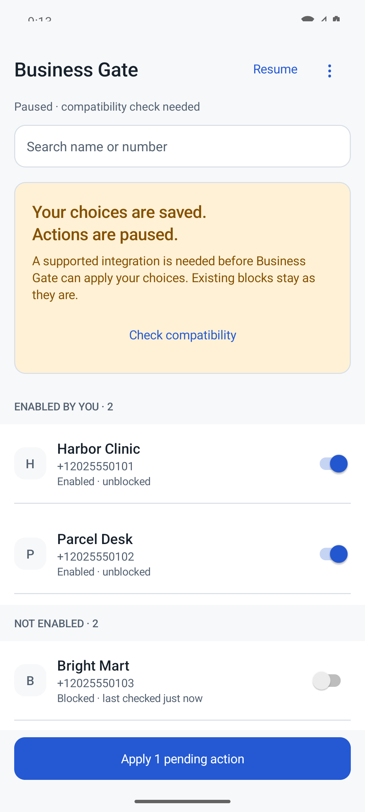
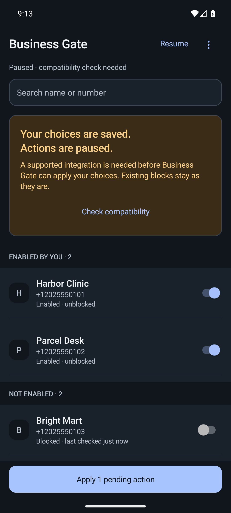

# Business Gate

Choose the businesses. Keep the people.

A native Android app for managing exact-number business blocking choices, based on the supplied one-page design. It uses an original blue gate identity, Java, and Android framework components. No third-party runtime libraries, login, analytics, network permission, ads, or subscription.

**Development build: connected-app blocking is disabled.** The native interface, local policy and persistence, safety evaluator, optional hint classifier, guarded action controller, permission disclosures, and test harness are implemented. No production integration has been physically qualified. The bundled compatibility registry is intentionally empty. This is not yet a working connected-app blocker or a paid release.

## Try the native interface

[**Download the latest installable APK**](https://github.com/appunni-m/business-gate/releases/download/development/business-gate.apk) · [All builds and checksums](https://github.com/appunni-m/business-gate/releases) · [Build status](https://github.com/appunni-m/business-gate/actions/workflows/android.yml)

Requires **Android 10 or newer**. Open the APK and allow installation from your browser or file manager when Android asks. No GitHub login is needed to download. Each successful `main` build publishes a signed development APK; later downloads install as updates and preserve local choices. Connected-app actions remain disabled.

To build locally:

Use JDK 17, Android SDK Platform 36 and Build Tools 35.0.0. The verified wrapper pins Gradle 8.13; the build pins Android Gradle Plugin 8.13.2. Set `JAVA_HOME` and `ANDROID_HOME` to your installations.

```sh
./gradlew :app:assembleDebug
"$ANDROID_HOME/platform-tools/adb" install -r app/build/outputs/apk/debug/app-debug.apk
```

Open **Business Gate**. Choose **Enable a number** from the overflow menu, enter the full international number and an optional local label, and save. Your preference persists without screen access. Search matches local names and number digits. The app explains that actions are paused; saving a choice never pretends to have changed another app.

There are no sample accounts on a normal installation. Screenshots and the test APK use fictional accounts inserted only by instrumentation.

## Verify a change

```sh
scripts/test.sh
./gradlew :app:lintDebug :app:lintRelease :app:assembleDebugAndroidTest \
  :app:assembleRelease :app:bundleRelease
python3 scripts/check_brand.py app/build/outputs/apk/release/app-release-unsigned.apk \
  app/build/outputs/bundle/release/app-release.aab
```

For the native test harness, use an isolated emulator:

```sh
export GATE_TEST_SERIAL=emulator-5554
scripts/device-tests.sh
```

The device script deliberately rejects physical device serials because it resets local app data and inserts fictional test records. It checks actual process-restart recovery as well as policy persistence and rendered UI. The pure suite does not require Android or a network connection.

The delivery workflow signs the verified release APK with a private publisher key stored in an encrypted repository secret. It verifies the signature and installation before publishing a versioned GitHub prerelease and updating the continuous download link. The release includes checksums and source/build metadata. Pull requests only verify code. Signing keys are never committed.

Local Gradle release APK/AAB files remain unsigned; debug artifacts use the local Android debug key and a separate application ID. These are development distributions, not store releases. See [delivery and signing](docs/delivery.md) for the one-time setup, automatic checks, updates, and failure recovery.

## What the screen does

- One native page with pinned search, enabled businesses first, expandable account details, and truthful pending/observed subtitles.
- Exact-number enablement and manual review decisions. Same-name senders never share permission. Keep prevents automatic blocking; manual Block requires confirmation.
- Setup and access disclosures, pause, compatibility explanation, offline privacy information, local diagnostics and effort totals, and confirmed local reset.
- System light/dark appearance, growing rows, native switches, 48 dp controls, and a centered single column on wide screens.

The switch represents your choice. The subtitle represents a pending operation or a separately observed outcome. Pausing or deleting local data does not undo blocks in another app. The first message can arrive before discovery.

## Continue implementation and qualification

[Implementation and evidence](docs/implementation.md) identifies tested behavior and unfinished integration work. [Adapter qualification](docs/qualification.md) defines the physical inputs and stop conditions. [Privacy](docs/privacy.md) describes the binary's data boundary. [Contributing](CONTRIBUTING.md) describes the development workflow.

The neutralized [full specification](docs/design/Business_Gate_Full_PRD_Design.md), [companion specification](docs/design/Business_Gate_Complete_PRD_Design.md), and [HTML design reference](docs/design/prototype.html) preserve the supplied requirements. They are design inputs, not evidence of completed features. The full specification's added review/manual-choice model is used; independent blue branding overrides its accent choice.

No open-source license has been selected by the owner. Repository visibility alone does not grant an open-source license. The Gradle wrapper is distributed under its upstream license; see [third-party notices](THIRD_PARTY_NOTICES.md).

## Native screenshots

API 36 emulator, fictional test records, connected-app actions inactive. [Large text](docs/screenshots/large-text.png) uses a 320 dp viewport and 200% font scale.

 
