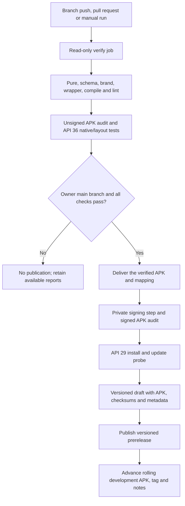

# Android workflow review

Reviewed 10 September 2026 at source commit `408eb9d9226072f8fda2d341e1fddb3d72ddf8e4`. Scope: workflow and delivery scripts, public run/job/annotation/release data, anonymous artifact downloads, local offline publication tests and workflow lint. This review made no workflow changes, dispatched no run, read no signing secret and installed no APK.

## Incoming-feature review · 14 September 2026

The workflow still gates main-branch delivery on successful verification, audits and signs the verified build, runs the separate signed-upgrade probe, and verifies anonymous versioned and rolling downloads. The incoming change adds `notifications` to the required native-mode manifest; release metadata rejects a verification manifest missing that mode. Local evidence passes 45 notification/event assertions and all 646 assertions across 15 native modes. No signing secret was inspected or changed. The original run-20 findings below remain a historical checkpoint; each later release carries its own run/commit verification.

## Verdict

**The current workflow works for signed development APK delivery.** [Run 20](https://github.com/appunni-m/business-gate/actions/runs/34456095039) completed successfully at 08:44:02 UTC on 10 September 2026. Both [verify](https://github.com/appunni-m/business-gate/actions/runs/34456095039/job/102802707873) and [deliver](https://github.com/appunni-m/business-gate/actions/runs/34456095039/job/102804297879) passed. The [versioned release](https://github.com/appunni-m/business-gate/releases/tag/build-102001) contains a signed APK, checksums and build metadata. The [continuous APK download](https://github.com/appunni-m/business-gate/releases/download/development/business-gate.apk) works without a GitHub login.

It does not establish completion of the app or live blocking. The downloaded APK's validated metadata says `connectedAppActionsEnabled: false` and has no qualified adapters. That is the correct result for the current empty registry.

## Evidence checked

| Check | Result |
| --- | --- |
| Source | Build metadata and versioned release identify `408eb9d9226072f8fda2d341e1fddb3d72ddf8e4`. |
| Version | `0.1.0-dev.20.1`, version code `102001`, minimum API 29, target API 36. |
| Native verification | Public annotations report core 253, UI restoration 20, storage-boundary 32 and performance 80 assertions. The combined native/layout step passed. |
| Performance | Query p95 60 ms at 10,000 records; database plus WAL 3,734,456 bytes; 50,000-record snapshot 1,114 ms. Environment: CI API 36 x86_64 emulator. |
| Signed installation/update | API 29 delivery annotations report 32 preparation and 18 verification assertions. The probe's prerequisite failure would fail delivery. |
| Public downloads | Versioned APK, `build-info.json`, `SHA256SUMS` and rolling APK downloaded anonymously. |
| Integrity | Both checksum entries match; metadata's APK hash matches the file; versioned and rolling APK bytes are identical. |
| Signing | `apksigner verify --verbose --print-certs` passes with the committed publisher certificate. No private credential was used locally. |
| Rolling source | Actual `git/ref/tags/development` resolves to the reviewed commit; notes contain version `102001` and matching APK hash. The release object's historical `target_commitish` is not used as the moving tag's identity. |
| Capability | Registry/capability digest computed from the APK agrees with `build-info.json`; connected actions are disabled. |
| Local static checks | `actionlint` passes and all 13 offline delivery tests pass. |

APK SHA-256: `a000c944e6303c9264d00b6cd83beb2f70cd7156c22f5365ca33fd1c9d334ed2`.

Publisher certificate SHA-256: `c6c88c88271d2b702e7ebfb3717c59e2663a6fdee82c01a95118f10689061564`.

The compact [review evidence](workflow-review-evidence.json) records the checks and public source URLs. Raw review downloads/logs are local under `/tmp/business-gate/plan-review-*`; they are not a permanent public evidence archive. The latest local API 36 signed-upgrade proof remains build `101601`. Build `102001` was inspected but not installed in this pass.

## Why recent runs were red

| Run | Result and cause | Delivery effect |
| --- | --- | --- |
| [16](https://github.com/appunni-m/business-gate/actions/runs/34445510013) | Passed; published build `101601`. | Last published baseline before the later corrections. |
| [17](https://github.com/appunni-m/business-gate/actions/runs/34449903447) | Failed a legacy search-clear assertion that assumed a top row instead of the restored scroll anchor; reproduced locally and corrected. | Delivery skipped. |
| [18](https://github.com/appunni-m/business-gate/actions/runs/34451758306) | Core passed; UI restoration test assumed an empty-state card was already visible below setup; reproduced and corrected with stable-row scrolling. | Delivery skipped. |
| [19](https://github.com/appunni-m/business-gate/actions/runs/34453034270) | Native modes passed; short landscape at larger text/display scale left too little list space. A product layout defect was reproduced and fixed. | Delivery skipped. |
| [20](https://github.com/appunni-m/business-gate/actions/runs/34456095039) | Verification, layout, signing, signed update and publication passed. | Published build `102001`. |

These failures were test gates working as intended. The evidence does not identify the configured signing secret as a problem. See the [UI verification record](ui-verification.md) for the reproducible cases and test corrections.

## Existing pipeline architecture

The [workflow](../.github/workflows/android.yml) builds with Java 17, platform API 36 and build tools 35.0.0. It retains read-only permissions for verification and grants `contents: write` only to delivery. Delivery requires successful verification and the owner's `main`; pull requests and other branches cannot publish. Checkout does not persist credentials. The signing secret is referenced only in the signing step. The [signer](../scripts/sign_apk.py) masks parsed credential components, uses a private temporary key file, deletes temporary material and rejects an unexpected certificate or partial signing result.

The same verified unsigned APK and mapping are transferred to delivery; delivery does not rebuild the source after testing. A separate self-instrumenting debug probe checks the signed app without receiving the publisher key or becoming part of the shipped APK. The package, SDK baseline and compatibility claims come from the actual binary through [release metadata generation](../scripts/release_metadata.py).

The [publisher](../scripts/publish_release.py) uploads versioned assets as a draft before making them public. It refuses to change already-published versioned bytes. It checks newer versioned tags and rolling version markers before advancing the continuous channel. A failed rolling update can leave a complete versioned release available; the documentation already describes that recovery path.

## Findings and proposed workflow changes

These are follow-up improvements, not changes made during review. No current build-blocking defect was found in the reviewed run.

### WF1 · P1 — Verify the public result automatically

**Observed gap:** the final step returns after GitHub upload/tag/notes commands. It does not independently download the new public versioned and rolling assets and compare them. This review performed that missing end-to-end check manually and it passed.

**Proposed design:** after publication, use anonymous HTTPS downloads into a separate temporary directory. Verify both checksum entries, package/version/API metadata, certificate, source commit/run, actual moving tag ref and APK-derived capability digest. Compare rolling bytes with versioned bytes. Use bounded retries for propagation delays; repeated mismatch fails the run and preserves the complete versioned URL in its summary. Never recreate the publisher key, replace published versioned bytes or silently downgrade the rolling channel to hide a failure.

**Acceptance:** inject missing assets, changed bytes, stale notes/tag, wrong certificate and delayed visibility in offline tests. A successful real run shows both “published” and “public download verified,” with version and direct APK link.

### WF2 · P1 — Retain a complete, identifiable test report

**Observed gap:** the report upload includes text results and owned PNGs, but no automatically generated layout/environment manifest with image hashes. Native and layout suites share one emulator action step, making the first failure less obvious. Success annotations cover some named modes; the green step alone is not a complete per-case review record. Current actionlint validation is local, not a step in this workflow or `scripts/test.sh`.

**Proposed design:** preserve the existing test failure semantics, but give native and layout phases clear log groups and summaries. Generate and retain one machine-readable manifest with commit/run, SDK image, API, ABI, emulator pixel dimensions, density, font/theme/navigation mode, test modes, assertion counts, failures/unrun cells and owned-rendering hashes. Retain the probe lint report as well. Pin and run actionlint in verification. Every required evidence file must be present; do not convert missing files to success.

**Acceptance:** a deliberately failing native/layout case produces a named failing scenario plus its environment in retained evidence; successful 24-case layouts list all cases and images. An absent required manifest fails verification. Reports must contain only synthetic owned data and bounded technical metrics.

### WF3 · P1 — Pin all action code and record the toolchain

**Observed gap:** the emulator runner and artifact downloader use full commit SHAs, while checkout, Java setup, Android setup and artifact upload use version tags. `ubuntu-latest` and the installed system-image revision can also change. This is a reproducibility/hardening gap, not evidence of a compromise.

**Proposed design:** resolve each existing action version to its upstream commit and pin that SHA with a readable version comment. Record actual JDK, Gradle, runner, SDK/build-tools and emulator/system-image revisions in the report. Preserve the current API 36 compile/target and API 29 minimum; moving them is a separate behavior review. Add an intentional dependency-update procedure. GitHub recommends full-SHA pinning for immutable action references. [GitHub secure-use guidance](https://docs.github.com/en/actions/reference/security/secure-use#using-third-party-actions)

**Acceptance:** actionlint and the existing gates pass; every `uses:` entry resolves to a reviewed full upstream SHA; evidence identifies tool revisions. Do not claim a bit-reproducible build solely because direct actions are pinned.

### WF4 · P2 — State the queue and trigger contract precisely

**Observed behavior:** every branch push is eligible for verification, including documentation-only changes. Only successful owner-main runs deliver. Main's running workflow is not canceled by a later push, but the current default concurrency queue may replace an older pending run. Therefore the workflow does not promise a distinct APK for every rapidly pushed commit. GitHub documents a single pending slot by default. [GitHub concurrency reference](https://docs.github.com/en/actions/how-tos/write-workflows/choose-when-workflows-run/control-workflow-concurrency)

**Proposed default:** retain “publish every successful main build, with the newest pending push taking precedence.” State that explicitly in delivery instructions and the run summary. Keep docs on the same gates for now; a path filter is an optional later optimization. If a durable queue for every commit is wanted, design a main-only queue separately and validate its interaction with pull-request cancellation and version ordering before editing YAML. Current GitHub documentation offers `queue: max`; it is incompatible with `cancel-in-progress: true`, so it cannot be added blindly to the present shared configuration.

**Acceptance:** test rapid pushes/retries in a controlled future workflow exercise and verify no older APK replaces a newer rolling build. Canceled pending runs are reported as superseded, never as a published APK.

### WF5 · P1 — Expand publication interruption tests

**Observed gap:** 13 offline tests cover useful publication/signing/instrumentation failures, including a failed rolling upload. They do not inject every later GitHub mutation boundary or post-publication read failure. The publisher's comments/documentation describe draft resumption, but the existing suite lacks a dedicated preexisting-draft recovery case.

**Proposed design:** extend the existing offline transport fake with preexisting draft, versioned publish failure, tag-update failure, notes-update failure, missing version marker, pagination, identical rerun and out-of-order completion cases. Assert the artifact/version state after each failure and retry, not just the calls made. Cover first release, ordinary predecessor update and failed-job rerun without confusing run-attempt version generation with the already-verified artifact's version.

**Acceptance:** immutable versioned bytes are never replaced; interrupted drafts resume; every failure stops downstream publication as appropriate; a complete versioned download remains usable after a rolling-only failure; the newer rolling version always wins. WF1's independent checker catches partial public state.

## Evidence limits and owner decisions

- No local install, full app/device test rerun, new release or workflow mutation occurred in this review. Local verification here was read-only artifact inspection, actionlint and offline delivery tests.
- The signing configuration is already working. There is no need to add another secret for the proposed checks. Repository branch-protection/settings were not audited through an authenticated account; no assertion about their configuration is made.
- The existing JSON secret handling explicitly masks its parsed components. Preserve that behavior and the step boundary. A future credential-format change would need a separate migration; it is not a prerequisite for normal builds.
- Releases provide the public installer. Actions artifacts are retained build/report archives and should not be the sole user download path. [GitHub artifact-download guidance](https://docs.github.com/en/actions/how-tos/manage-workflow-runs/download-workflow-artifacts)
- Verification reports have 14-day retention; signed Actions artifacts have 90-day retention. Versioned release assets remain until removed by the owner. The proposed compact manifest should accompany long-lived version evidence so reports do not depend entirely on short-lived run artifacts.
- Live compatibility, physical tests, TalkBack, remaining local lifecycle cases and the pilot remain app-completion work in the [design plan](completion-design-plan.md). A downloadable installable APK does not prove those capabilities.

## Validation of this review

The existing workflow passes actionlint and all 13 offline delivery tests. Anonymous downloads pass file/metadata checksums, actual APK signature/publisher pin, package/version/API inspection, APK capability validation, versioned/rolling byte equality and rolling tag/notes checks. The initial local signature command needed the already-installed JDK 17 selected through `JAVA_HOME`; it then passed. That local shell environment issue was not a workflow or APK failure.

Documentation link/structure, source branding and traceability checks are run after writing this review. Their results are reported with the plan; no proposed implementation or unrun acceptance case is labeled passed.
